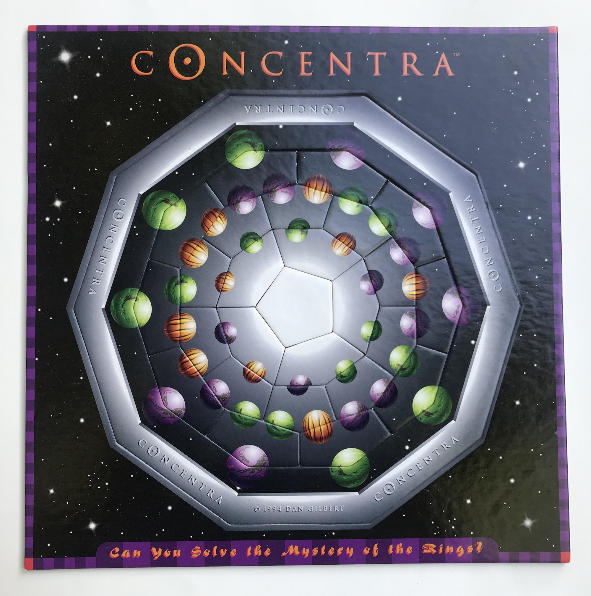

# Concentra Solver (Angular Updated Version) #

## Background ##

* For the original version and an explanation of the solving process, see its [GitHub repo](https://github.com/danego/circle-puzzle).

* The _Concentra_ puzzle is an [edge-matching puzzle](http://www.robspuzzlepage.com/pattern.htm), which means that the pieces are largely interchangeable and a solved state is one where all of the pieces' decorative edges align, as opposed to a jigsaw puzzle where each piece has more or less one correct spatial location. Probably the most popular and largest commercial edge-matching puzzle is the [_Eternity Puzzle_](http://www.mathpuzzle.com/eternity.html) by Christopher Monckton. While _Concentra_ is much smaller, there are still trillions of possible piece permutations, of which the puzzle claims there is only a single solution ... 

* The edge matching in this puzzle is done not side to side, but from layer to layer. There are three total layers: 10 pieces in the first (which must match the immovable starting positions), 10 again in the next, and 5 in the final layer. Pieces in the same layer do not need to match.

***
## Major Changes / New Features ##

* This new version is interactive while also providing info and hints about solutions. This means the user can not only see the different solutions, but can also attempt to solve the puzzle themselves. On the code side, the Angular framework has greatly reduced the redundancy in creating all of the different pieces.

* The solver now has all three puzzle patterns and their solutions. Switch between them from the control panel. Because of their differences in piece composition, the "Planets" pattern has 63 solutions and the "Egypt" and "Atlantis" patterns (same pieces but with different colors) have 7 solutions. The solving algorithm handles both easily. Interestingly, because the "Planets" pattern has only two colors in the fixed Layer Zero, it has 16 times more possible permutations, but only 7 times more solutions than the other two patterns.

* One particularly exciting feature is the "Remaining Solutions" tracker which displays how many solutions are still viable based on the currently placed pieces. If the puzzle is empty then the number will be either 63 or 7 because all solutions are viable. This feature enables solving in a wholly new, unintuitive manner.

* The app is mightily responsive, changing layouts, features, and actual puzzle size to best complement each screen range.

***
## Angular Material Drag & Drop ##

* The main solving capability is built off of the Angular Material Drag and Drop Module. The problem is that the module is designed for vertical or horizontal lists, i.e., a flexbox layout. While this works largely unaltered for the Piece Bank Component, it requires many alterations to make it work for the Circle Representation Component (as well as across multiple components). In this component, each empty piece slot is a _dropList_ connected to its own array containing exactly zero or one elements, as opposed to one dropList or array for all elements.

* The multiple dropLists are connected to the rest of the dropLists in their layer via the keyword _cdkDropListGroup_ which is placed on a parent element. In addition, each dropList is connected to the corresponding single dropList for that layer in the Piece Banks Component and vice versa using _cdkDropListConnectedTo_. Individual pieces are decorated with the _cdkDrag_ selector. Pieces can only be dropped into connected dropLists.

* When the user begins dragging a piece, the source component (Circle Representation or Piece Banks) reaches out to the Bank Circle Connector Service to update the variable _isDragging_ by layer. This state update is used to apply the correct cursors: 'not-allowed' when over a wrong layer or a non-empty slot and 'grab' when over an empty slot in the correct layer. While not dragging hovering over any piece will display the 'grab' cursor. 

* While dragging, the _cdkDragPreview_ is displayed. Because of the rotation of the pieces and quick succession of displays across dropLists, I've opted for the semi-transparent pink puzzle piece icon (normally implying extensions). In contrast, when dragging from the piece banks the _cdkDragPreview_ is displayed as the actual piece, albeit partially transparent, because the distance across components is large enough and the number of successive rotations fewer.

* After the drag has ended the correct _isDragging_ variable is reset to false. Note: a dropped piece triggers both _dropped()_ and _dragEnded()_ while a drag end does not require a dropped event. When a piece is dropped into a slot _dropList_, _dropped()_ is called:
  *  It first checks if the piece is a viable fit such that the selected dropList is empty (correct layer check is done implicitly as mentioned above). If it's not the piece remains in its previous dropList.

  *  Otherwise the piece is transferred to the new array and dropList and the remaining solutions are computed (see Solutions Grabber Service section below). The new piece location is also recorded in the internal piece ID sequence tracking.

  * If the piece originated from the Piece Bank Component, then that component is informed to update its sizing for the applicable layer (_droppedInCircle()_ in Bank Circle Connector Service).

***
## Components ##

* **Circle Representation**

  * Contains the crux of the puzzle, holding all piece-slot dropLists, zero to all of the pieces, and the static Layer Zero which serves as a starting point for the puzzle.

  * Holds the default size ratios for the overall puzzle and its layers. Based off these, it is later sized dynamically using _font size_ and _em_ units (see Piece Sizing Service below). Also, while dragging a piece over a non-empty dropList, the already placed piece remains visibly unchanged by creatively setting the position and z-index values for the incoming and placed pieces.

  * Both this component and the Piece Bank have the ability to toggle the letters on the pieces off or on. This is done by _ngIf_ and a complimentary _ng-template_.

* **Piece Bank** 

  * The piece banks are a reserve area for unused puzzle pieces. Each layer has its own closeable section to allow the user the best experience for their own solving strategy. Unlike the Circle Representation Component, each layer only has one dropList. 

  * While dragging a piece over the Piece Banks the appropriate layer temporarily opens if not already open, based on the _isDraggingIncoming_ variable. One major difficulty that came with these expandable sections was getting the drop zone to be recognized and easily accessible. At first the Drag and Drop simply would not recognize the dropLists after they were moved on screen. I worked around this by carefully arranging the nesting of the dropLists, pieces, drop toggle switch, and container, as well as making the drop zones invisible and correctly z-indexed. 
  
  * Additionally, when a piece is dragged over the bank (_mouseenter_) the corresponding layer's dropList makes room for the incoming piece by enabling an invisible element of the correct size that pushes the other pieces, but also sits under the new piece (which still maintains its "absolute" position from the Circle Component).

  * The height of the Piece Bank is set to a max just shy of the Circle Representation. Consequently when many pieces are in the bank the overall height (_scrollHeight_) is greater than the max and the different layers can be hidden without scrolling. In order to allow the user to scroll while dragging a piece, I built scroll zones that programmatically scroll down or up to the correct layer and then return to the previous position after a drop or drag end. These only appear if applicable based on layer and current scroll position and can be disabled through the Control Panel.

  
*  **Control Panel(s)**
    * There are two control panel components--the main one used for mobile and laptop and larger screens (Vertical) and a secondary, horizontal variant for tablet-sized screens (no extra identifier). I split them up because of the major differences in size, layouts, and spacing. They are created once the current layout is determined (see Piece Sizing Service).

    * The "Solutions Panel" provides one handy location to store, and hide if desired, the hints and info about solutions. 
      * Select a dropdown value to load in a new solution and have it displayed in the Circle Representation Component. 

      * If the number of solutions is overwhelming, the Material Slide Toggle will limit the number of displayed solutions to 10 (only applicable with the "Planets" pattern). Start with an empty (or mostly empty) circle to place pieces in yourself and see how that affects the "Solutions Remaining Counter."

    * There are two modes that appear dynamically and can be toggled on or off based on user preference:
      1. _autoOpenEnabled_ deals with the lack of _mouseenter_ events when on mobile--the touch events are inadequate because they focus more on the origin of the event. Thus, the Auto Open feature opens the corresponding layer in the Piece Bank any time a drag is started. 

      2. _scrollZonesEnabled_, as discussed above in the Piece Bank Component, is used to allow dragging and scrolling. Thus, this is only applicable for users with mouse capabilities and is limited to laptop and larger screens.

    * The buttons are stored internally as a Reactive Form so as to easily be able to keep track of current preferences and patch values (e.g. when switching to a new puzzle pattern).

    * The dropdowns for "pattern name" and "solution number" are either native or the external library _ng-select_:
      1. Native dropdowns are used on mobile and tablet and set to 16px to stop any automatic zoom.

      2. _ng-select_ dropdowns are used because the number of solutions is so great for the one pattern (63) that the native dropdowns become cumbersome. It also allows for a convenient change in display between unselected and selected value for the solution number: "10 --> Solution: 10."

    * Other Buttons: 
      * "Move all to Circle/Bank" - simultaneously moves all pieces to either the Piece Bank or Circle Representation component. 

      * "Toggle Letters Off" - solve by color only or use letter representations too.

***
## Services ##

* **Bank Circle Connector**
  * This service exists to transfer data across the Piece Bank and Circle Representation components, largely for when drags start or end and when pieces are dropped. It also informs the components when to transfer all pieces either to circle or bank and to toggle the color letters on or off.

* **Piece Sizing**
  * The dynamic sizing of the app is controlled through this service. After the Calculate Height Directive is called, it proceeds to find the max height and corresponding font size ratio for the puzzle.

  * First it takes into account the screen size and layout style to arrange the Piece Bank and Control Panel components around the Circle Representation. Then if the individual piece sizes are larger than the Piece Bank width, it recalculates. It also takes into account if this generated circle size is greater than the overall container height and/or is greater than the predetermined max size. Based on the generated circle size it determines a "font size factor" based off of the default size ratios for the circle representation. The circle size is also used to set heights for the Control Panel and Piece Bank Components. The actual font size for the letters on the pieces is also calculated.

  * This service also is the central location for the different layers' piece dimensions--the only other location to update is in "styles.css." Therefore changing the visuals of the puzzle can be done at the drop of a hat because there is no need to track down changes in the numerous calculations across components. To ensure stability in these many references, it saves the variables according to the _SizingDataInterface_.

  * One value in this interface is "bankWidth," which refers to the width of that layer's piece bank. If that number is greater than the actual piece width then there will be multiple columns of pieces in the bank dropdown. This is used most heavily on small screens where vertical space is limited and the pieces are small enough to fit several columns.

* **Pieces Catalog**
  * Here is where all of the initial piece values (i.e. 1 - 3 values of characters corresponding to the preset colors on each piece and a layer-unique ID) for each pattern are stored. The Piece Sizing Service reaches out to this catalog to retrieve a deep copy of the newly selected pattern pieces. 

* **Solutions Generator**
  * This service returns an array containing the ID sequences of all generated solutions. To solve, it takes the current pattern's pieces (no change needed to handle the different patterns) and begins by comparing pieces against the immutably ordered Layer Zero pieces. 

  * It works recursively and fails fast on unviable sequence branches to quickly check all permutations of the inputted puzzle pattern. Currently it is called whenever the pattern changes, but the solving process is smooth enough that the delay is almost imperceptible.

  * For a full explanation of the solving process see the [older version's readme](https://github.com/danego/circle-puzzle).

* **Solutions Grabber**
  * This service handles currently-placed-piece tracking and move-all-pieces logic; pattern switching; and remaining solutions calculations.

  1. Piece Tracking
      * The main piece tracking is the "currentPuzzlePiecesSequence" which tracks the pieces currently placed in the Circle Representation. The sequence is saved as arrays of the piece IDs--not the whole piece itself--and with empty strings for empty slots.

      * When a new solution is selected, the "currentPuzzlePiecesSequence" ID sequence is switched to match that of the new solution. If "move all pieces" is clicked an empty or default ID sequence is used instead.

      * It also keeps track of _allPiecesUsed_ for computing solutions remaining.

  2. Patterns
      * When a new pattern is selected, this service reaches out to the Piece Catalog Service for the new pieces and then passes these to the Solution Generator Service. It then passes the number of solutions to the control panel for the dropdowns. 

  3. Remaining Solutions
     * "computeRemainingSolutions()" is called whenever a piece is dropped--thus when a piece is either added to the circle and current sequence or to the bank and thus removed from the current sequence. It runs through the array of all generated solutions and compares each piece slot. If the slot is empty or the piece matches the current sequence, then that solution is added to the tally. Any non-matching, placed piece eliminates that solution number as viable. Thus, when no pieces are placed all solutions are possible / viable.

      * If all pieces are used and 1 solution still remains then the current sequence must exactly match some solution. So "determineCurrentSolutionNumber()" is called to return that solution number. 

***
## Directives ##

* **Calculate Height**
  * Is placed on the HTML container that contains the piece bank, circle representation, and vertical control panel (if applicable).

  * Prepares the dynamic sizing for the puzzle by determining and then passing the layout and the dimensions to the Piece Sizing Service. 

* **Position (Top, Left, Bottom) Start**
  * In the previous iteration the positioning of the pieces was hard-coded in and was spaced unevenly. The three positioning directives fix both of these problems by computing positioning programatically. 

  * The directives are placed on each dropList in the Circle Representation Component and are passed in a piece index, circle diameter, piece width, piece height, and current font size. The first four of these values are the ratios which are to be multiplied by the last value, the dynamic font size.

  * First, based on the number of pieces to space around the circle, a correct circular degree value is calculated. Then the circular degree value is converted to the correct degree (based on the quadrant) of a triangle abutting the x-axis. This value is then converted from radians into degrees, then into x and y values accounting for the width and height of the piece. These two values are changed to pixel positions from the correct side (top or bottom and right or left). Finally the correct degrees of rotation are applied based on piece index. The rotation and position values are applied via _HostBinding_ to the current element. 

  * This process ensures that the pieces are spaced very evenly (some small precision is lost due to the dynamic sizing of _font-size_ and _em_ being limited to 3 decimal places) while also being able to quickly resize. Additionally, stylistic changes to the piece designs only require updates to the width and height, not any updates on the tedious and difficult-to-apply-by-hand circular positioning.

* **Stop Propo**
  * This directive stops the propagation of click events. It is used in the Piece Bank Component so that a click on a piece will not close the open bank section around that piece.

***
## Future Improvements ##

* The biggest improvement will be to replace the heavy lifting of the services with NgRx. Not only will this help move more business logic out of the components, but it will also provide a cleaner platform on which to add other state-based features.

* One such feature will be to make "Move all to Bank/Circle" retain already placed pieces. Additionally, the pieces would not be moved according to the default ID sequence, but would be randomized each time.

* Another state-based feature would be the ability for the user to save their current progress and control panel preferences with customizable names to LocalStorage. This would be a new component that pops up when called from the Control Panel Component(s). Then the user could have several different ongoing attempts.

***
## Attributions ##

* Modules from [Google's Angular Material](https://material.angular.io/), i.e. '@angular/material/*':
  * MatSlideToggleModule
  * DragDropModule

* ng-select library for dropdowns: [NPM Page](https://www.npmjs.com/package/@ng-select/ng-select)

* The puzzle pieces background image is a SVG pattern created by Steve Schoger, as found on his website [Hero Patterns](http://www.heropatterns.com/), CC 4.0.

* ReadMe Images:
  * Planets pattern, mine.
  * Egypt pattern, [Worthpoint.com](https://www.worthpoint.com/worthopedia/concentra-damert-company-dan-gilbert-1852164598).
  * Atlantis pattern, [Dan Gilbert Art Group](http://www.dangilbert.com/triazzle.php).

